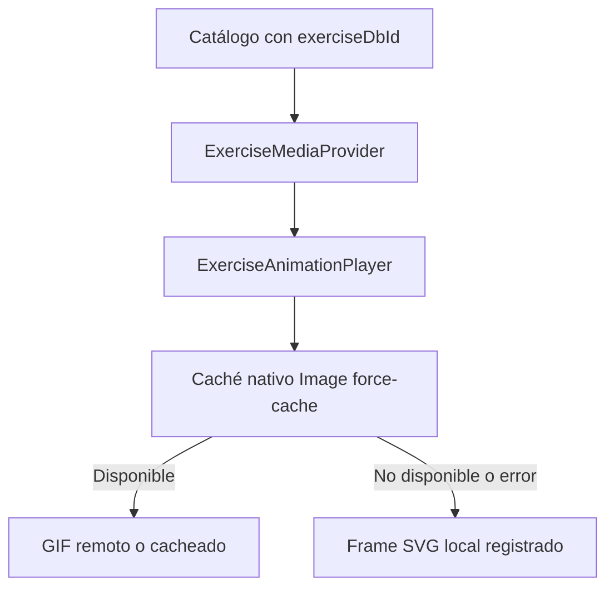

# Caché de medios de ejercicio

## Propósito y alcance

Los GIF remotos mejoran la demostración visual, pero nunca son requisito para entrenar. Este diseño usa el caché persistente nativo de imágenes como optimización y mantiene los frames SVG registrados como ruta offline garantizada.

## Detalles de implementación

| Componente | Responsabilidad |
|---|---|
| `createCachedGifSource` | Construir la fuente con política `force-cache`. |
| `MediaLoadCache` | Evitar spinners repetidos durante la sesión mediante LRU acotado. |
| `ExerciseAnimationPlayer` | Cambiar a SVG cuando la imagen falla y reintentar al elegir otro ejercicio. |
| `ANIMATION_REGISTRY` | Resolver el frame local extensible. |

## Casos de borde

- Sin red y sin GIF previamente almacenado: se muestra el SVG local.
- Sin red y con GIF nativo cacheado: el sistema puede mostrar el GIF sin una nueva descarga.
- Error de un GIF: no se retiene el error para el siguiente ejercicio.

## Referencias

- `src/components/animations/gifMediaSource.ts`
- `src/core/exerciseMedia/MediaLoadCache.ts`
- `src/components/animations/animationRegistry.ts`
