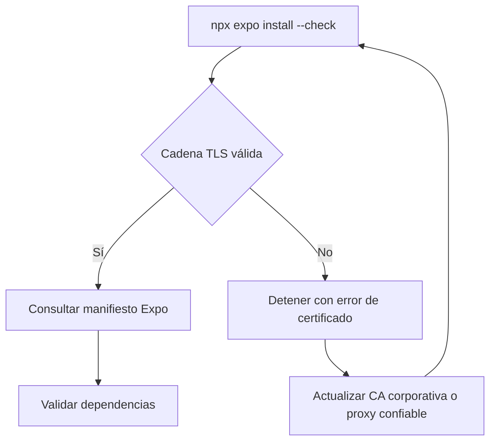

# Validación de dependencias Expo y TLS

## Propósito y alcance

`npx expo install --check` debe consultar el manifiesto de Expo para validar dependencias compatibles. En este entorno, la solicitud al registro falla por validación de la cadena de certificados. No se desactiva TLS ni se registran valores de proxy o CA.



## Evidencia observada

- `strict-ssl` permanece activo.
- Hay una configuración de proxy y una CA explícita, sin exponer sus valores.
- La consulta falla con `UNABLE_TO_VERIFY_LEAF_SIGNATURE`.
- La validación local sigue disponible: TypeScript, reglas de arquitectura y Jest pasan.

## Acción requerida fuera del repositorio

El administrador de red o el propietario de la CA debe instalar/configurar una cadena de certificados válida para el proxy/registro. Después se debe ejecutar:

```text
npx expo install --check
```

No usar `strict-ssl=false` ni ignorar errores de certificado.
