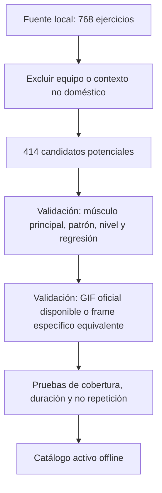

# Matriz de curación del catálogo de ejercicios

## Propósito y alcance

Preparar la ampliación del catálogo local sin importar automáticamente los 768 registros de ExerciseDB. Este documento no activa ejercicios en la app: define la puerta que cada registro debe superar antes de entrar en una rutina.

## Exclusiones de la primera criba

Se excluyen de entrada nombres o instrucciones que requieran banco, pelota, máquina, barra, cable, Smith, BOSU, rueda, ejercicios colgados, dominadas, dips, palancas, asistencia externa, decline, preacher o Scott. La criba es conservadora: un candidato restante **no** está aprobado todavía.

## Cobertura actual y reserva de candidatos

| Grupo semanal | Activos nivel 1 / 2 / 3 | Candidatos después de criba | Distribución candidata por equipo |
|---|---:|---:|---|
| Pecho y espalda | 4 / 5 / 7 | 64 | 50 peso corporal, 7 mancuernas, 6 bandas, 1 liga |
| Bíceps y tríceps | 0 / 6 / 2 | 63 | 43 mancuernas, 15 peso corporal, 5 bandas |
| Hombro y trapecio | 1 / 12 / 5 | 48 | 38 mancuernas, 8 bandas, 2 peso corporal |
| Abdomen y oblicuos | 9 / 2 / 5 | 93 | 73 peso corporal, 18 bandas, 2 mancuernas |
| Pierna y glúteo | 14 / 7 / 9 | 109 | 67 peso corporal, 27 mancuernas, 13 bandas, 2 ligas |
| Core y cardio | 11 / 3 / 7 | 112 | 91 peso corporal, 18 bandas, 3 mancuernas |

Los candidatos se pueden compartir entre `abs_obliques` y `core_cardio` solo cuando el patrón realmente corresponde a ambos; no se duplicarán artificialmente para cumplir una cuota.

## Cuotas de publicación

Cada grupo y nivel tendrá cobertura independiente; un músculo secundario no cuenta para completar otra categoría.

| Duración | Ejercicios principales por sesión | Cuota para 4 semanas sin repetir el mismo ejercicio |
|---|---:|---:|
| 20 min | 3 | 12 |
| 30 min | 4 | 16 |
| 60 min | 7 | 28 |

Antes de publicar una duración, su cuota debe completarse para **ese** grupo y nivel. Mientras una cuota no exista, el selector no podrá presentar una sesión con duración nominal que no puede llenar.

## Contrato de aprobación por ejercicio

Un candidato solo pasa a activo si cumple todos los puntos:

1. `exerciseDbId` existe en la fuente y no está duplicado en el catálogo activo.
2. Equipo e instrucciones son compatibles con hogar: peso corporal, mancuernas, liga o banda; silla o pared solo cuando se indiquen como apoyo estable.
3. El músculo principal pertenece al grupo semanal; los secundarios se guardan como información, no como criterio de selección.
4. Nivel, impacto, estabilidad, volumen y regresión cumplen la matriz de `workout-coach`.
5. Se define un patrón de movimiento que no duplica una variante idéntica ya publicada.
6. El GIF oficial debe resolver correctamente o existir un frame local específico y biomecánicamente equivalente; una familia genérica no es evidencia suficiente.
7. La ficha incluye instrucciones en español, equipo, series, descanso y consejo de seguridad.

## Orden de curación

1. Bloque crítico de cobertura: bíceps/tríceps nivel 1 y 3; hombro/trapecio nivel 1; abdomen/oblicuos nivel 2; core/cardio nivel 2.
2. Completar a siete ejercicios para cualquier combinación de grupo/nivel que muestre 60 min.
3. Completar primero las cuotas de 20 y 30 min de los grupos más usados; después la cuota de 60 min.
4. Validar medios y registrar los nuevos frames o GIFs antes de activar cada lote.

## Riesgos y controles

- La fuente clasifica por implemento, no por seguridad ni nivel: la asignación automática de nivel queda prohibida.
- El validador visual actual solo reconoce que existe una familia de frame; se sustituirá por una validación de equivalencia por ejercicio.
- La rotación no puede depender únicamente del día: la integración posterior deberá incorporar semana del calendario e historial local de ejercicios mostrados.

## Referencias

- `.agents/skills/workout-coach/resources/exercisedb_home_catalog.json`
- `.agents/skills/workout-coach/SKILL.md`
- `.agents/skills/exercise-animator/SKILL.md`
- `src/core/workoutGroupPolicy.ts`
