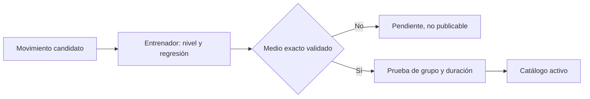

# Lote crítico de candidatos — no activo

## Propósito y alcance

Este lote cubre las combinaciones que hoy no llegan a siete ejercicios principales para sesiones de 60 minutos. Los registros se seleccionan desde la fuente local por músculo diana y equipo permitido; **no se agregan todavía al catálogo activo**.

## Criterios aplicados

- Solo peso corporal, mancuernas, liga o banda; sin máquinas.
- Se excluyeron banco, pelota, barra, cable, ejercicios colgados, dips y variantes que dependan de equipo no garantizado.
- El músculo diana de la fuente es el que define el grupo; los músculos secundarios no se usan para clasificarlo.
- Los niveles propuestos se basan en estabilidad, impacto, carga y técnica, no en el implemento por sí solo.
- Todos conservan `exerciseDbId`; las URLs de GIF no se guardan en el catálogo.

## Candidatos seleccionados

| Déficit | ID fuente | Movimiento a localizar | Equipo | Nivel propuesto | Regresión / control |
|---|---|---|---|---:|---|
| Bíceps/tríceps | `3s4NnTh` | Curl de bíceps de pie | Mancuernas ligeras | 1 | Una mancuerna o rango corto |
| Bíceps/tríceps | `2NpxjC1` | Curl martillo | Mancuernas ligeras | 1 | Alternar brazos sentado |
| Bíceps/tríceps | `0IgNjSM` | Curl inverso | Mancuernas ligeras | 1 | Menor carga, muñeca neutra |
| Bíceps/tríceps | `BCUR88E` | Extensión de tríceps a una mano | Mancuerna ligera | 1 | Sentado con respaldo estable |
| Bíceps/tríceps | `PdmaD0N` | Extensión de tríceps de pie | Mancuerna ligera | 1 | Una mano y rango cómodo |
| Bíceps/tríceps | `bQy2Eni` | Patada de tríceps a una mano | Mancuerna ligera | 1 | Apoyo en silla estable |
| Bíceps/tríceps | `s0HKO2I` | Extensión de tríceps de rodillas | Peso corporal | 1 | Manos en pared o superficie elevada |
| Bíceps/tríceps | `kXaIn5A` | Curl Zottman | Mancuernas | 3 | Curl martillo simple |
| Bíceps/tríceps | `Qyk5J3p` | Curl martillo cruzado | Mancuernas | 3 | Curl martillo bilateral |
| Bíceps/tríceps | `DU5Kkj2` | Curl inverso unilateral | Mancuerna | 3 | Dos manos o menor carga |
| Bíceps/tríceps | `UmpPAAe` | Patada de tríceps de pie | Mancuernas | 3 | Apoyo en silla y carga ligera |
| Bíceps/tríceps | `Gi2BXfK` | Patada de tríceps alternada | Mancuernas | 3 | Variante bilateral estable |
| Hombro/trapecio | `DsgkuIt` | Elevación lateral | Mancuernas ligeras | 1 | Elevar solo hasta rango cómodo |
| Hombro/trapecio | `3eGE2JC` | Elevación frontal | Mancuernas ligeras | 1 | Alternar brazos y poca carga |
| Hombro/trapecio | `84RyJf8` | Press de hombro a una mano | Mancuerna ligera | 1 | Sentado con respaldo |
| Hombro/trapecio | `mu5Guxt` | Apertura posterior | Mancuernas ligeras | 1 | Sin carga y rango corto |
| Hombro/trapecio | `aHDy5O5` | Elevación en Y con banda | Banda ligera | 1 | Sin banda o menor recorrido |
| Hombro/trapecio | `NJzBsGJ` | Encogimiento de trapecio | Mancuernas ligeras | 1 | Pausa breve y carga mínima |
| Abdomen/oblicuos | `iny3m5y` | Dead bug | Peso corporal | 2 | Talón al suelo y recorrido corto |
| Abdomen/oblicuos | `RKjH6Lt` | Plancha lateral | Peso corporal | 2 | Apoyar rodilla inferior |
| Abdomen/oblicuos | `XVDdcoj` | Giro ruso controlado | Peso corporal | 2 | Pies apoyados y poco giro |
| Abdomen/oblicuos | `nCU1Ekp` | Crunch inverso | Peso corporal | 2 | Menor flexión de cadera |
| Abdomen/oblicuos | `tuIZFDt` | Plancha de rodillas con toque | Peso corporal | 2 | Toque lento sin rotar pelvis |
| Core/cardio | `0Yz8WdV` | Caminata de oso | Peso corporal | 2 | Pasos cortos o apoyo elevado |
| Core/cardio | `fNGumX0` | Paso adelante y atrás | Peso corporal | 2 | Ritmo lento, siempre un pie apoyado |
| Core/cardio | `J9zIWig` | Marcha con rodilla alta | Peso corporal | 2 | Marcha en sitio sin zancada |
| Core/cardio | `RJgzwny` | Escalador | Peso corporal | 2 | Manos elevadas en pared o silla |

## Estado de publicación

| Verificación | Estado |
|---|---|
| ID existe en recurso local | Aprobado para los 27 candidatos |
| Grupo por músculo diana | Aprobado provisionalmente |
| Nivel y regresión | Propuesto; se valida en la ficha final |
| GIF oficial | Identificado por `exerciseDbId`; disponibilidad HTTP aún no verificada |
| Fallback local equivalente | No validado |
| Inclusión en catálogo activo | **Bloqueada** |

La publicación queda bloqueada hasta que se corrija el contrato multimedia: un SVG genérico no puede sustituir una técnica distinta. Los GIF oficiales serán el medio principal cuando estén disponibles; para modo sin conexión cada ejercicio requiere una representación local equivalente, no una animación reutilizada de otro movimiento.

## Cobertura prevista tras publicación

- Bíceps/tríceps nivel 1: de 0 a 7 principales; nivel 3: de 2 a 7.
- Hombro/trapecio nivel 1: de 1 a 7.
- Abdomen/oblicuos nivel 2: de 2 a 7.
- Core/cardio nivel 2: de 3 a 7.

Esto resuelve la cobertura mínima de sesiones de 60 minutos para el lote crítico; no satisface aún la cuota de cuatro semanas sin repetir. Esa cuota se completa en lotes posteriores, sin usar músculos secundarios como relleno.
