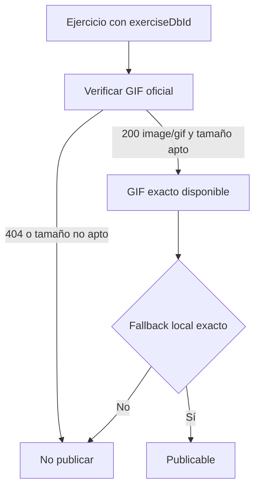

# Auditoría multimedia — lote crítico

## Propósito y alcance

Verificación HTTP de los 27 GIF oficiales propuestos en `CATALOG-010-critical-candidates.md` y revisión del comportamiento de fallback del reproductor actual. La consulta fue de solo cabeceras: no se descargaron ni almacenaron GIFs.

## Resultado de disponibilidad

| Estado | Cantidad | IDs |
|---|---:|---|
| `200 image/gif`, tamaño dentro de 150 KB | 24 | Todos salvo los listados abajo |
| `200 image/gif`, supera 150 KB | 2 | `XVDdcoj` (152,384 B), `fNGumX0` (173,160 B) |
| `404` | 1 | `tuIZFDt` |

Los 24 GIF aptos responden con `Content-Type: image/gif` y tienen tamaños entre 58,472 B y 137,047 B. El resultado no prueba todavía la calidad técnica del movimiento: se valida contra el nombre, músculo diana e instrucciones de la misma fuente antes de publicación.

## Hallazgo de causa raíz

`ExerciseAnimationPlayer` intenta primero el GIF remoto. Si ocurre `onError`, ejecuta `resolveAnimationFrame(type)` y muestra el SVG asociado al tipo genérico.

Ese mecanismo responde a disponibilidad, pero no a equivalencia: por ejemplo, un GIF de curl inverso puede terminar mostrando el frame de curl normal, y un GIF de extensión de tríceps puede mostrar una animación de empuje que representa otro gesto. El indicador `animationAudit: verified_family` solo comprueba que el tipo existe en el registro, no que el frame describa el `exerciseDbId` concreto.

## Veredicto por candidato

- Los 24 medios de tamaño apto quedan **pendientes de fallback local exacto**.
- `XVDdcoj` y `fNGumX0` quedan bloqueados hasta disponer de una variante más ligera o una política de descarga/caché que respete el presupuesto de rendimiento.
- `tuIZFDt` queda rechazado: no se incorporará ni se sustituirá por un frame genérico. Debe reemplazarse por otro ejercicio con GIF verificable.
- Ningún candidato pasa aún al catálogo activo, porque no existe un fallback local exacto para ese movimiento.

## Cambio obligatorio antes de publicar contenido

1. El contrato de medios debe declarar si el fallback local es exacto para el ejercicio, no solo para una familia de movimientos.
2. El reproductor debe mostrar un estado local honesto cuando no haya un fallback exacto; no puede cambiar a una animación de otra técnica.
3. Cada ficha nueva debe pasar: ID fuente, HTTP 200 de GIF, tamaño, equivalencia visual, fallback local y prueba de contrato.
4. El catálogo activo solo puede referenciar ejercicios que ya superaron ese contrato.

## Referencias

- `src/components/ExerciseAnimationPlayer.tsx`
- `src/components/animations/GifCanvasPlayer.tsx`
- `src/core/exerciseMedia/ExerciseMediaProvider.ts`
- `src/app/exerciseMediaComposition.ts`
