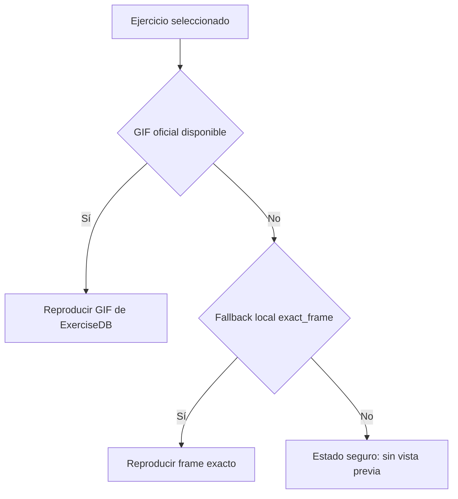

# MEDIA-004 — Contrato estricto de representación de ejercicios

## Problema corregido

La aplicación trataba un SVG de la misma familia como sustituto visual de cualquier GIF que fallara. Esto podía mostrar una técnica distinta al ejercicio seleccionado. El reproductor ahora separa explícitamente la disponibilidad del GIF oficial y la existencia de un frame local exacto.

## Contrato y alcance

- `officialGif`: evidencia de la URL oficial (`verified`, `unverified` o `unavailable`).
- `localFallback`: solo `exact_frame` autoriza un SVG local como sustituto.
- Las 93 entradas heredadas no declaran `exact_frame`; si no carga su GIF, se conserva la descripción, consejos y prescripción, pero no se renderiza una técnica ajena.
- Las nuevas entradas deben pasar `isReadyForExercisePublication`: GIF verificado y frame local exacto.

Esto reemplaza la afirmación anterior `verified_family`: compartir una familia de animación ya no es evidencia de equivalencia biomecánica.
