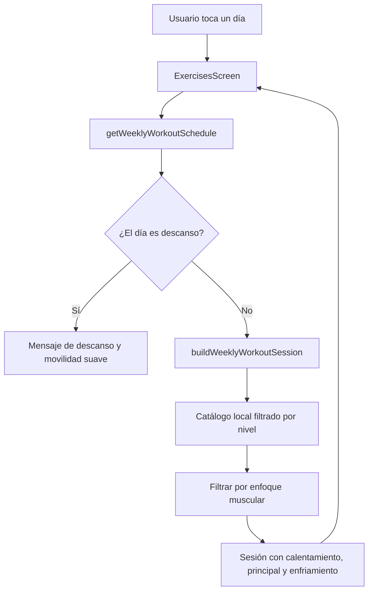

# Reporte de cumplimiento — WEEKLY-002

- Solicitud y autorización del usuario: “procede con el siguiente paso”.
- Tipo de cambio: nueva funcionalidad de sesión semanal enfocada por grupo muscular.
- Archivos modificados: `src/core/weeklyWorkoutSession.ts`, `src/screens/ExercisesScreen.tsx` y `__tests__/weeklyWorkoutSession.test.ts`.
- Skills aplicados: workout-coach, mobile-dev, mobile-qa y doc-mermaid.

## Propósito y alcance

Al tocar un día del semanario, Ejercicios presenta una sesión del nivel del usuario y del enfoque programado. Los días de descanso no prescriben ejercicios y muestran una indicación de recuperación segura.

## Flujo de selección

## Verificación SOLID

- SRP: el selector de ejercicios semanales vive en `weeklyWorkoutSession`; la pantalla solo conserva el día seleccionado y renderiza el resultado.
- OCP: los enfoques se amplían mediante la tabla `FOCUS_MUSCLES`, sin condicionales nuevos en UI.
- LSP: la sesión resultante conserva el contrato `WorkoutSessionPlan` usado por las secciones existentes.
- ISP: `ExercisesScreen` usa los selectores específicos de perfil y plan; el constructor recibe solo duración, nivel, enfoque y catálogo.
- DIP: el catálogo es una dependencia opcional inyectable; el valor local por defecto mantiene operación offline.

## Validaciones

- `npm run typecheck`: correcto.
- `npm run architecture:check`: correcto; sin URLs remotas en el catálogo.
- Pruebas unitarias/integración: 12 suites y 46 pruebas correctas. Se valida selección de empuje y conservación de las tres fases al cambiar enfoque.
- QA funcional o UAT aplicable: pendiente de prueba manual Android/iOS para toque, estado seleccionado y desplazamiento horizontal del semanario.

## Deuda y excepciones

- Deuda reducida o afectada: se elimina la desconexión entre tarjeta semanal y contenido de la sesión. No se añade persistencia del día seleccionado porque es estado efímero de pantalla.
- Excepciones aprobadas por el usuario: integración sobre cambios locales existentes.
- Veredicto: APROBADO PARA INTEGRACIÓN TÉCNICA.
