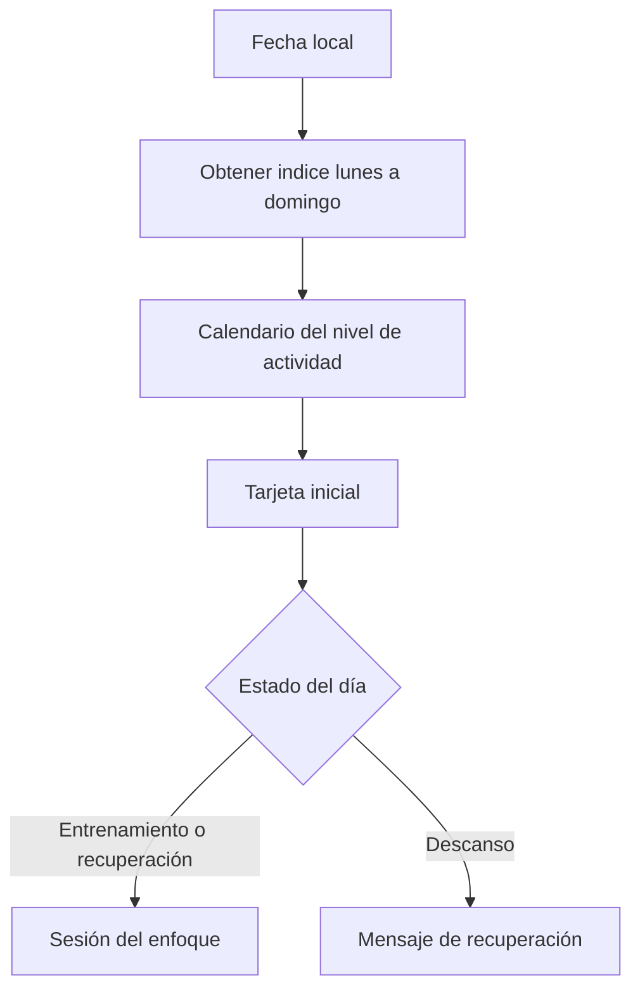

# Reporte de cumplimiento — WEEKLY-003

- Solicitud y autorización del usuario: “vamos por el siguiente paso”.
- Tipo de cambio: mejora funcional del calendario semanal.
- Archivos modificados: `src/core/weeklyWorkoutPlanner.ts`, `src/screens/ExercisesScreen.tsx` y `__tests__/weeklyWorkoutPlanner.test.ts`.
- Skills aplicados: workout-coach, mobile-dev, mobile-qa y doc-mermaid.

## Propósito y alcance

La pantalla Ejercicios abre inicialmente la tarjeta que corresponde al día local actual. No cambia la distribución semanal ni registra actividad: tocar otra tarjeta sigue siendo una consulta temporal.

## Flujo de calendario

## Casos de borde

- El índice convierte correctamente domingo, que JavaScript representa como cero, al último día del calendario lunes-domingo.
- La función acepta una fecha inyectada para pruebas deterministas y evita depender de la zona UTC.
- Si el usuario abre la app otro día, una nueva carga de la pantalla obtiene la fecha local actual.

## Verificación SOLID

- SRP: `getWeeklyWorkoutDayForDate` solo traduce fecha local a día programado; la UI conserva el estado temporal de selección.
- OCP: el cálculo depende del orden del calendario recibido, por lo que admite nuevos esquemas sin editar la pantalla.
- LSP: devuelve el mismo contrato `WeeklyWorkoutDay` usado por el semanario.
- ISP: la UI solicita únicamente calendario y día actual; no amplía el store.
- DIP: la fecha y el calendario se reciben como parámetros, sin dependencias de reloj o persistencia global.

## Validaciones

- `npm run typecheck`: correcto.
- `npm run architecture:check`: correcto.
- Pruebas unitarias/integración: 12 suites y 47 pruebas correctas; cubre lunes, domingo y descanso intermedio.
- `git diff --check`: sin errores de espacios.
- QA funcional o UAT aplicable: pendiente en Android/iOS para verificar la selección inicial visible y el contraste de tarjeta activa.

## Deuda y excepciones

- Deuda reducida o afectada: se corrige la selección inicial fija del primer día entrenable. No se añade nueva deuda ni persistencia innecesaria.
- Excepciones aprobadas por el usuario: integración sobre cambios locales existentes.
- Veredicto: APROBADO PARA INTEGRACIÓN TÉCNICA.
