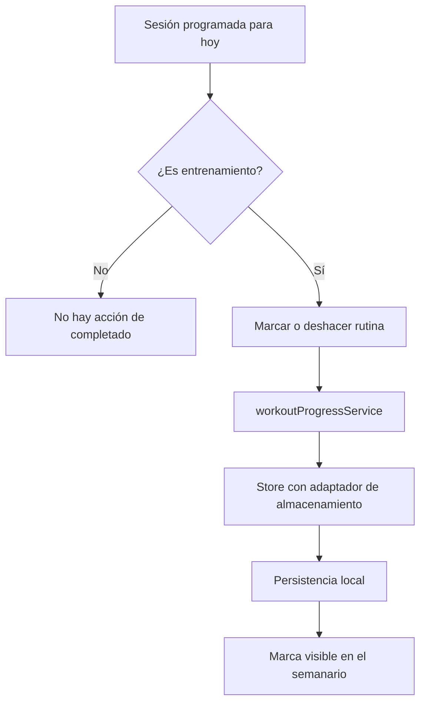

# Reporte de cumplimiento — WORKOUT-003

- Solicitud y autorización del usuario: “continua con el punto 3”.
- Tipo de cambio: nueva funcionalidad de registro local de rutina completada.
- Archivos modificados: tipos, `workoutProgressService`, store, selector de progreso, acción visual, pantalla Ejercicios y pruebas.
- Skills aplicados: fitness-committee, change-planner, mobile-ui-ux, workout-coach, mobile-dev, mobile-qa y doc-mermaid.

### Dictamen del Comité de Expertos

- **Propuesta evaluada:** marcar la rutina programada para hoy como completada.
- **Veredicto:** APROBADO CON OBSERVACIONES.
- **Salud:** no permite marcar descanso ni recomienda compensar sesiones omitidas.
- **UX:** una acción reversible, visible solo para hoy, evita culpa y registros accidentales de días futuros.
- **Privacidad:** fecha, enfoque y duración permanecen en almacenamiento local; no se agregan trackers ni red.
- **Ajuste aplicado:** se muestra confirmación visual y se permite deshacer el registro.

## Flujo de progreso

## Verificación SOLID

- SRP: el servicio crea y conmuta registros; el store orquesta y persiste; el componente solo renderiza la acción.
- OCP: el historial indexado por fecha admite nuevos metadatos en `WorkoutCompletion` sin cambiar la acción visual.
- LSP: `WorkoutCompletion` es un dato serializable y no altera contratos de plan existentes.
- ISP: `useWorkoutProgress` expone exclusivamente historial y mutación de progreso.
- DIP: el store persiste mediante `StorageAdapter`; el servicio es puro y recibe sus datos por parámetros.

## Validaciones

- `npm run typecheck`: correcto.
- `npm run architecture:check`: correcto; sin dependencias remotas de catálogo.
- Pruebas unitarias/integración: 13 suites y 50 pruebas correctas. Cubren fecha local, alternancia completar/deshacer, rechazo de descanso y persistencia con adaptador inyectado.
- QA funcional o UAT aplicable: pendiente de prueba manual Android/iOS para objetivo táctil, feedback visual y restauración tras reiniciar la app.

## Deuda y excepciones

- Deuda reducida o afectada: la rutina semanal deja de ser solo informativa y registra progreso offline. No se introducen ejercicios con máquinas ni sincronización externa.
- Excepciones aprobadas por el usuario: integración sobre cambios locales existentes.
- Veredicto: APROBADO PARA INTEGRACIÓN TÉCNICA.
