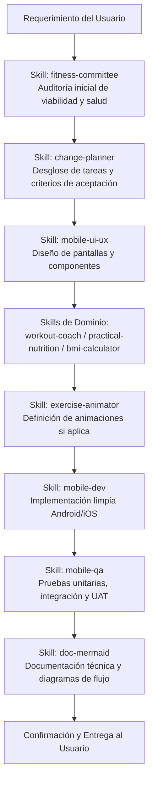
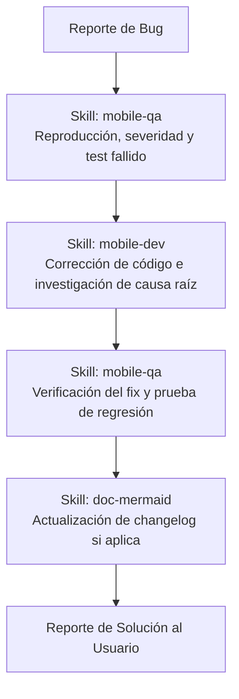
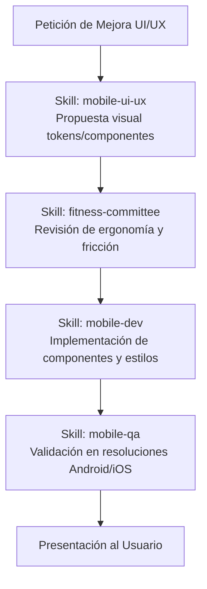
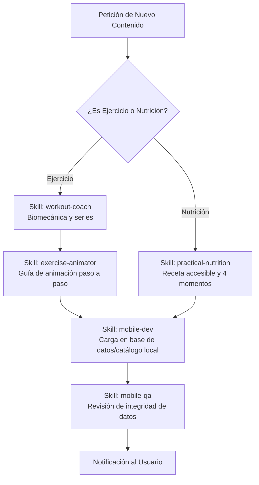

# Reglas del Proyecto y Flujos de Desarrollo de la Aplicación Móvil

Este documento define el sistema de gobernanza, los estándares obligatorios y el protocolo de trabajo paso a paso que debe seguirse para **cualquier acción en el proyecto**: implementar funciones nuevas, corregir fallos (bugs), realizar mejoras de interfaz/UX o actualizar contenido.

---

## 1. Reglas Cardinales del Proyecto

1. **Autorización Expresa del Usuario:**
   - Ningún cambio en código fuente, creación de archivos de la aplicación o reestructuración mayor se ejecutará sin la confirmación explícita del usuario.
2. **Offline-First & Privacidad:**
   - La aplicación debe funcionar sin internet. Todos los datos de peso, comidas y ejercicios se almacenan localmente.
3. **Cero Máquinas de Gimnasio:**
   - Los ejercicios son exclusivamente en casa: peso corporal, mancuernas/pesas libres, ligas de resistencia y bandas elásticas para piernas.
4. **Comidas Cotidianas y Accesibles:**
   - La alimentación se estructura en **Desayuno, Comida, Cena y Snacks**, con ingredientes económicos y fáciles de adquirir. Cero recetas gourmet inaccesibles.
5. **Diferenciación Rigurosa de Métricas por Sexo:**
   - El cálculo de IMC y peso ideal debe contemplar variantes anatómicas para hombre y mujer.
6. **Validación Colegiada:**
   - Toda funcionalidad nueva debe ser validada por el comité de expertos antes de pasar a desarrollo.
7. **Principios SOLID — OBLIGATORIOS en Todo el Código:**
   - **Todo módulo, componente, servicio, hook o catálogo nuevo** debe cumplir los 5 principios SOLID.
   - Los skills `mobile-dev`, `mobile-ui-ux`, `virtual-pet` y `exercise-animator` documentan la aplicación específica de cada principio en su dominio.
   - Ningún código que viole SOLID puede ser entregado sin documentar la justificación técnica aprobada por el usuario.
   - **Resumen obligatorio por principio:**
     - **[S]** Un módulo = una razón de cambio. Lógica de dominio fuera de componentes UI y del store.
     - **[O]** Catálogos extensibles con patrón Registry. Nunca `if/else` en players/selectors.
     - **[L]** Las interfaces extendidas son sustituibles por su tipo base sin alterar el contrato.
     - **[I]** Props mínimas por componente. Selectors específicos de store, no el store completo.
     - **[D]** Persistencia detrás de `StorageAdapter`. Servicios de dominio con dependencias inyectadas.

---

## 2. Tipos de Solicitud y sus Flujos de Trabajo Obligatorios

Cualquier petición debe clasificarse en uno de los siguientes 4 flujos de desarrollo:

### Flujo 1: Nueva Funcionalidad (Feature Flow)
Se utiliza para agregar nuevas pantallas, módulos o capacidades a la app.

### Flujo 2: Corrección de Fallos / Errores (Bugfix Flow)
Se utiliza ante errores de cálculo, cierres inesperados, desajustes de pantalla o datos no guardados.

### Flujo 3: Mejora Visual / Experiencia de Usuario (UI/UX Enhancement)
Se utiliza para mejorar transiciones, fuentes, paleta de colores, microanimaciones o tiempos de respuesta táctil.

### Flujo 4: Actualización de Contenido (Content Update)
Se utiliza para agregar nuevos ejercicios de casa (ligas, mancuernas, bandas) o nuevas recetas (Desayuno, Comida, Cena, Snacks).

---

## 3. Matriz de Responsabilidad de Skills por Flujo

| Skill | Flujo 1 (Feature) | Flujo 2 (Bugfix) | Flujo 3 (Mejora UI) | Flujo 4 (Contenido) |
|---|:---:|:---:|:---:|:---:|
| `fitness-committee` | ✅ Revisor Principal | ⚪ Opcional | ✅ Revisor | ⚪ Opcional |
| `change-planner` | ✅ Planificador | ⚪ Si es mayor | ✅ Coordinador | ⚪ Opcional |
| `mobile-ui-ux` | ✅ Diseñador | ⚪ Si es visual | ✅ Diseñador Principal | ⚪ Assets |
| `workout-coach` | ✅ Si es ejercicio | ⚪ Si es cálculo | ⚪ | ✅ Creador |
| `exercise-animator` | ✅ Si aplica | ⚪ | ✅ Si es animación | ✅ Creador |
| `practical-nutrition` | ✅ Si es comida | ⚪ | ⚪ | ✅ Creador |
| `bmi-calculator` | ✅ Si son métricas | ✅ En caso de bugs | ⚪ | ⚪ |
| `mobile-dev` | ✅ Ejecutor | ✅ Corrector | ✅ Ejecutor | ✅ Data loader |
| `mobile-qa` | ✅ Validador | ✅ Validador Principal | ✅ Validador | ✅ Validador |
| `doc-mermaid` | ✅ Documentador | ✅ Changelog | ⚪ | ⚪ |

---

## 4. Estándar de Comunicación y Calidad
- Cada entrega de código debe acompañarse de su resumen de pruebas ejecutadas por `mobile-qa` y su diagrama representativo por `doc-mermaid`.
- Cualquier duda funcional se consultará con el usuario antes de asumir supuestos.

---

## 5. Checklist SOLID Obligatorio — Aplicar en TODOS los Flujos

Antes de presentar cualquier código al usuario, el skill `mobile-dev` verifica este checklist:

| Principio | Pregunta de Verificación | Aplica a |
|---|---|---|
| **[S] SRP** | ¿Cada archivo tiene una única razón de cambio? | Todos los archivos |
| **[S] SRP** | ¿La lógica de XP/mascota está en `petService.ts`, no en el store? | `virtual-pet` |
| **[S] SRP** | ¿Los frames SVG son componentes separados del player? | `exercise-animator` |
| **[O] OCP** | ¿Los catálogos de animaciones usan `ANIMATION_REGISTRY`? | `exercise-animator` |
| **[O] OCP** | ¿Las variantes de botones/cards usan mapas de estilos (`VARIANT_STYLES`)? | `mobile-ui-ux` |
| **[O] OCP** | ¿La tabla de XP de la mascota es extensible sin modificar `computeXpGain`? | `virtual-pet` |
| **[L] LSP** | ¿`ExtendedExerciseItem` es sustituible por `ExerciseItem` sin cambiar comportamiento? | `mobile-dev` |
| **[L] LSP** | ¿Todos los frames implementan `AnimationFrameProps` con la misma firma? | `exercise-animator` |
| **[I] ISP** | ¿Los componentes consumen el store con selectors específicos? | `mobile-dev` |
| **[I] ISP** | ¿`VirtualPetView` solo recibe `shape`, `mood`, `level`, `dialogMessage`, `onPress`? | `virtual-pet` |
| **[I] ISP** | ¿Los props de componentes UI son mínimos y específicos? | `mobile-ui-ux` |
| **[D] DIP** | ¿La persistencia usa `StorageAdapter` en lugar de `AsyncStorage` directo? | `mobile-dev` |
| **[D] DIP** | ¿Los frames SVG son puros (sin imports de stores o AsyncStorage)? | `exercise-animator` |
| **[D] DIP** | ¿Las funciones de `petService` son puras sin efectos secundarios externos? | `virtual-pet` |

> Si algún ítem falla, la entrega se devuelve para corrección antes de presentarla al usuario.
