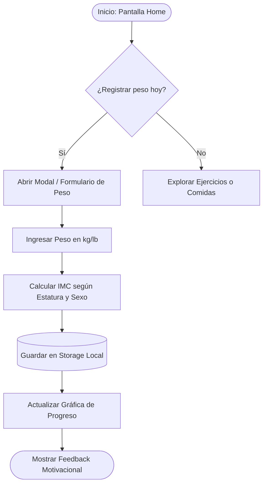
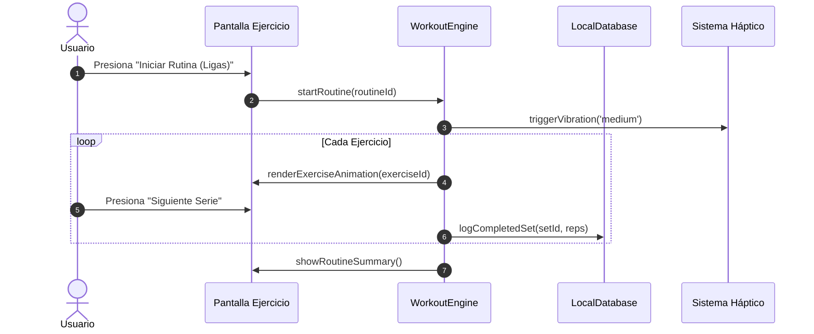
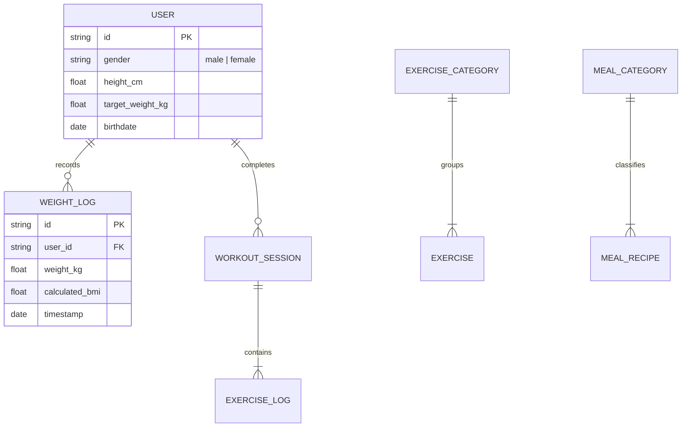

# Skill: Especialista en Documentación y Flujos Mermaid

Este skill es responsable de estandarizar, estructurar y mantener viva toda la documentación del proyecto, transformando requerimientos de negocio y arquitecturas de software en diagramas visuales claros y especificaciones técnicas precisas.

---

## 1. Tipos de Diagramas Mermaid Obligatorios en el Proyecto

### A. Diagramas de Flujo de Usuario (`flowchart TD / LR`)
Modelan el camino que sigue el usuario a través de las pantallas y funcionalidades de la app.
- Ejemplo para Registro de Peso e IMC:

### B. Diagramas de Secuencia (`sequenceDiagram`)
Para documentar interacción entre componentes, hooks, servicios y persistencia:

### C. Diagramas de Entidad-Relación (`erDiagram`)
Para modelar la base de datos local:

---

## 2. Reglas de Estilo para Diagramas Mermaid
1. **Evitar caracteres especiales en etiquetas:** Si se usan paréntesis o comillas, envolver el texto entre comillas dobles: `node["Texto (Detalle)"]`.
2. **Nombres de nodos semánticos:** Usar identificadores legibles (`HomeScreen`, `CalcService`) en vez de identificadores genéricos (`A`, `B`, `C`) en diagramas medianos o grandes.
3. **Flujo direccional coherente:** Usar preferentemente `TD` (Top-Down) para procesos paso a paso y `LR` (Left-Right) para pipelines o arquitecturas de capas.
4. **Legibilidad móvil:** Diagramas concisos y segmentados por módulo; no crear un único diagrama monolítico ilegible.

---

## 3. Estructura de Documentos Técnicos
Toda documentación técnica en el repositorio debe seguir la plantilla:
1. **Propósito y Alcance:** Qué resuelve este documento.
2. **Diagrama Mermaid Conceptual:** Vista visual inmediata.
3. **Detalles de Implementación:** Tablas de parámetros, tipos TypeScript o esquemas.
4. **Casos de Borde y Manejo de Errores.**
5. **Referencias Cruzadas:** Enlaces a otros archivos o skills relacionados.
