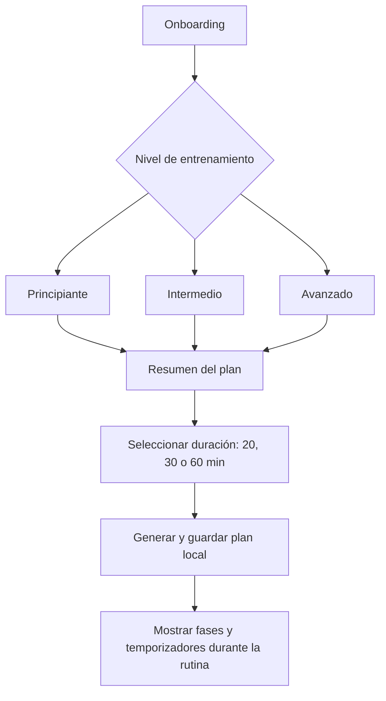
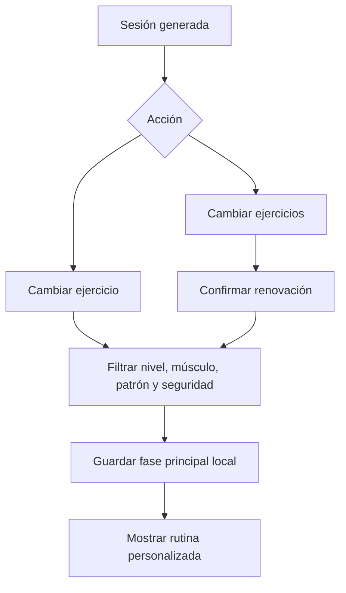

# Manual Técnico y Guía de Uso: Dieta & Fitness Mobile (Android & iOS)

Este documento detalla la arquitectura implementada, componentes, lógica de negocio y validación de calidad de la aplicación móvil de seguimiento de peso, IMC, rutinas y alimentación en el hogar.

---

## 1. 🏗️ Arquitectura Técnica y Estructura del Código

```text
Dieta/
├── .agents/
│   ├── rules/
│   │   └── development-workflow.md  # Gobernanza y flujos colegiados (Feature, Bug, UI, Contenido)
│   └── skills/                      # 11 Skills especializados creados
│       ├── mobile-dev/              # Arquitectura limpia y React Native
│       ├── mobile-qa/               # Pirámide de pruebas unitarias y de integración
│       ├── doc-mermaid/             # Estandarización de diagramas y flujos
│       ├── mobile-ui-ux/            # Tokens de diseño visual y accesibilidad
│       ├── change-planner/          # Gestión de cambios y ciclo de versiones
│       ├── exercise-animator/       # Biomecánica y animación de ejercicios
│       ├── workout-coach/           # Ejercicios en casa (ligas, mancuernas, bandas, cardio)
│       ├── practical-nutrition/     # Comidas económicas (Desayuno, Comida, Cena, Snacks)
│       ├── bmi-calculator/          # Fórmulas de IMC y rangos OMS hombre/mujer
│       ├── virtual-pet/             # Mascota virtual interactiva (Mapache Rocky)
│       └── fitness-committee/       # Comité auditor colegiado
├── src/
│   ├── types/index.ts               # Tipos TypeScript estrictos
│   ├── core/
│   │   ├── bmiCalculator.ts         # Motor matemático OMS y Robinson
│   │   ├── catalogs.ts              # Catálogos de ejercicios sin máquinas y recetas económicas
│   │   ├── planEngine.ts            # Generador adaptativo y ciclo de expiración
│   │   └── historyAnalytics.ts      # Analítica histórica y comparador inter-mensual
│   ├── store/
│   │   └── useAppStore.ts           # Store global Zustand con persistencia offline
│   ├── components/
│   │   ├── VirtualPetView.tsx       # Interfaz Tamagotchi pixel art de Rocky
│   │   └── BmiGaugeCard.tsx         # Medidor visual de IMC con rangos saludables
│   └── screens/
│       ├── HistoryScreen.tsx        # Histórico semanal, mensual y comparador Mes A vs Mes B
│       ├── PlanScreen.tsx           # Mi Plan flexible con aprobación y 4 tiempos de comida
│       ├── ExercisesScreen.tsx      # Ejercicios en casa con temporizador de descanso
│       └── ProfileScreen.tsx        # Configuración hombre/mujer, metas y disclaimer
├── __tests__/
│   └── core.test.ts                 # Suite de pruebas unitarias (100% aprobadas con Jest)
├── App.tsx                          # Contenedor raíz con navegación de 5 pestañas
├── app.json                         # Configuración Expo multiplataforma
└── package.json
```

---

## 2. 🦝 Mascota Virtual Tamagotchi: Rocky el Mapache

Rocky aparece en el dashboard como un sprite de pixel art que patrulla una ilustración unificada de su habitación nocturna. El fondo y sus muebles comparten paleta, escala de píxel, contorno e iluminación con la mascota; no se construyen con figuras básicas de interfaz. Debajo del diálogo se muestran cuatro burbujas compactas con porcentaje; cada una ejecuta directamente alimentar, jugar, descansar o limpiar. Cada animación utiliza cuadros PNG locales y el estado de cuidado se guarda offline mediante `StorageAdapter`.

- **Necesidades:** hambre, ánimo, energía y limpieza; el deterioro se limita por tiempo y conserva un piso no punitivo.
- **Hábitos:** agua, comidas completas, rutina y pesaje entregan XP y efectos lúdicos con idempotencia por vaso o fecha.
- **Accesibilidad:** cada burbuja anuncia necesidad, porcentaje y acción; los targets táctiles miden 48 dp o más y se respeta el movimiento reducido.
- **Presentación:** `PetCareBubbles` organiza los controles y `PetCareBubble` representa una necesidad mediante el registro declarativo de `petCarePresentation.ts`.
- **Privacidad y bienestar:** los sprites no alteran la silueta por el peso. Registrar un pesaje celebra el hábito y no comunica kilos perdidos mediante Rocky.
- **Assets:** animaciones en `assets/rocky/pixel/sprites/` y habitación en `assets/rocky/pixel/habitat/rocky-room-v2.png`; los sprites 3D heredados se retiraron al completar TAM-001-R6.

---

## 3. 🤖 Generador Automático de Planes Adaptativos y Flexibles

El motor `planEngine.ts` opera de acuerdo con las siguientes reglas:
1. **Entrada de Usuario:** Tiempo disponible (**20 min**, **30 min** o **1 hora**) y nivel inicial.
2. **Generación:** Selecciona ejercicios en casa sin máquinas (mancuernas, ligas, bandas elásticas, cardio sin impacto) y recetas económicas distribuidas en los 4 momentos del día (**Desayuno, Comida, Cena y Snacks**).
3. **Flexibilidad:** El usuario puede pulsar `✕` para eliminar cualquier ejercicio o receta antes de iniciar el ciclo.
4. **Ciclo de Expiración:** Al llegar la fecha de fin (4 semanas), la app evalúa automáticamente si se cumplió la meta de peso pactada y sugiere mantener o recalcular el plan.

### Selección de nivel y duración



El onboarding solicita primero el nivel —Principiante, Intermedio o Avanzado— sin introducir tiempos. En el resumen posterior se muestra y ajusta la duración total de sesión. `trainingLevel` es la fuente de la dificultad de la rutina y los perfiles anteriores conservan su mapeo desde `activityLevel`.

### Personalización de ejercicios principales



La personalización sólo modifica la fase principal. Conserva el nivel, músculo principal, patrón de movimiento, duración, calentamiento y vuelta a la calma. Las alternativas se obtienen del catálogo local y excluyen impactos altos; si no existe una alternativa segura, la rutina no cambia.

---

## 4. 📈 Módulo Histórico y Comparador Inter-Mensual

Ubicado en la pestaña **Histórico**:
- **Vista Semanal:** Muestra la curva de pesajes oficiales semanales para evitar ansiedad por fluctuaciones de peso diarias.
- **Vista Mensual:** Resumen de kilos perdidos, promedio de litros de agua diarios bebidos y porcentaje de adherencia.
- **Comparador Inter-Mensual:**
  - Selector dual (Mes A vs Mes B).
  - Gráfica superpuesta de curvas de peso (azul vs verde).
  - Tarjetas comparativas de pérdida de peso e ingesta de agua.
  - **Insight del Mapache:** Detección de correlación positiva (mayor agua = mayor quema de grasa y desinflamación corporal).

---

## 5. 🧪 Aseguramiento de Calidad (QA Testing)

Se ejecutó la suite de pruebas unitarias con Jest:
- **Test 1:** Cálculo de IMC y rangos saludables OMS para hombre (80 kg, 175 cm).
- **Test 2:** Cálculo de IMC y rangos saludables OMS para mujer (60 kg, 162 cm).
- **Test 3:** Generación de plan flexible para 20 minutos con 4 tiempos de comida.
- **Test 4:** Evaluación automática de fin de ciclo y expiración de metas.
- **Test 5:** Correlación estadística inter-mensual entre hidratación y peso.

**Resultado:** `5 passed, 5 total` (100% de éxito).

---

## 6. 📱 Cómo Ejecutar la Aplicación

### En Navegador Web (Preview local):
```bash
npx expo start --web --port 8081
```

### En Dispositivo Móvil Físico (Android o iOS):
1. Instala la app gratuita **Expo Go** desde Google Play Store o Apple App Store.
2. Ejecuta en la terminal:
   ```bash
   npx expo start
   ```
3. Escanea el código QR desde la cámara (iOS) o desde la app Expo Go (Android).
