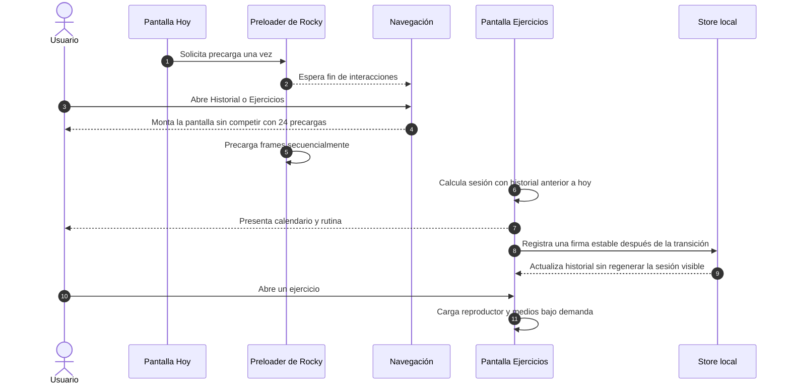

# PERF-001 — Rendimiento de navegación hacia Historial y Ejercicios

## Propósito y alcance

Eliminar el bloqueo percibido al salir de la pantalla Hoy y estabilizar el montaje de Ejercicios sin cambiar la interfaz, la rutina visible ni los datos persistidos. El alcance cubre la precarga local de Rocky y el registro de presentaciones de la sesión diaria.

La revisión R2 separa además el detalle multimedia: el reproductor, los frames SVG y el registro de GIF se inicializan solo cuando el usuario abre un ejercicio, no al cambiar de pestaña.

## Diagrama conceptual

## Detalles de implementación

| Área | Control aplicado | Resultado |
|---|---|---|
| Sesión diaria | Los registros del día actual no participan en la selección de esa misma sesión. | La rutina permanece estable durante el montaje. |
| Efecto de presentación | La dependencia es una firma formada por la clave de sesión, ejercicios y variantes. | Una actualización equivalente no dispara otra escritura. |
| Cálculos de pantalla | Calendario, sesión base y overrides usan memoización. | Se evita reconstruir objetos en renders no relacionados. |
| Detalle multimedia | `ExerciseDetailModal` se carga mediante `React.lazy`. | Los 18 frames SVG y 45 GIF no se inicializan al entrar al módulo. |
| Persistencia de presentación | La escritura espera a que terminen las interacciones y es cancelable al desmontar. | La serialización no compite con el primer render. |
| Precarga de Rocky | Se ejecuta después de las interacciones y un recurso a la vez. | La transición no compite con 24 solicitudes simultáneas. |
| Patrullaje | La animación nativa declara `isInteraction: false`. | El movimiento continuo no bloquea trabajo diferido. |

## Casos de borde y manejo de errores

- Un fallo al precargar un frame se aísla y no cancela los demás recursos.
- Los frames permanecen empaquetados localmente, por lo que el funcionamiento offline no cambia.
- La carga diferida del detalle usa módulos incluidos en el bundle nativo y no necesita red.
- Los registros futuros o del día actual no alteran retroactivamente la sesión visible.
- Sin perfil o plan activo, Ejercicios conserva el estado vacío existente y ejecuta los hooks de forma consistente.

## Referencias cruzadas

- `src/screens/ExercisesScreen.tsx`
- `src/components/ExerciseDetailModal.tsx`
- `src/core/weeklyWorkoutSession.ts`
- `src/components/virtual-pet/rockyAssetPreloader.ts`
- `src/hooks/useRockyPatrol.ts`
- `.agents/reports/PERF-001-navigation-performance-compliance-report.md`
