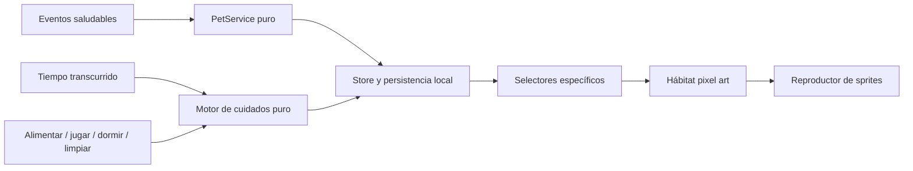
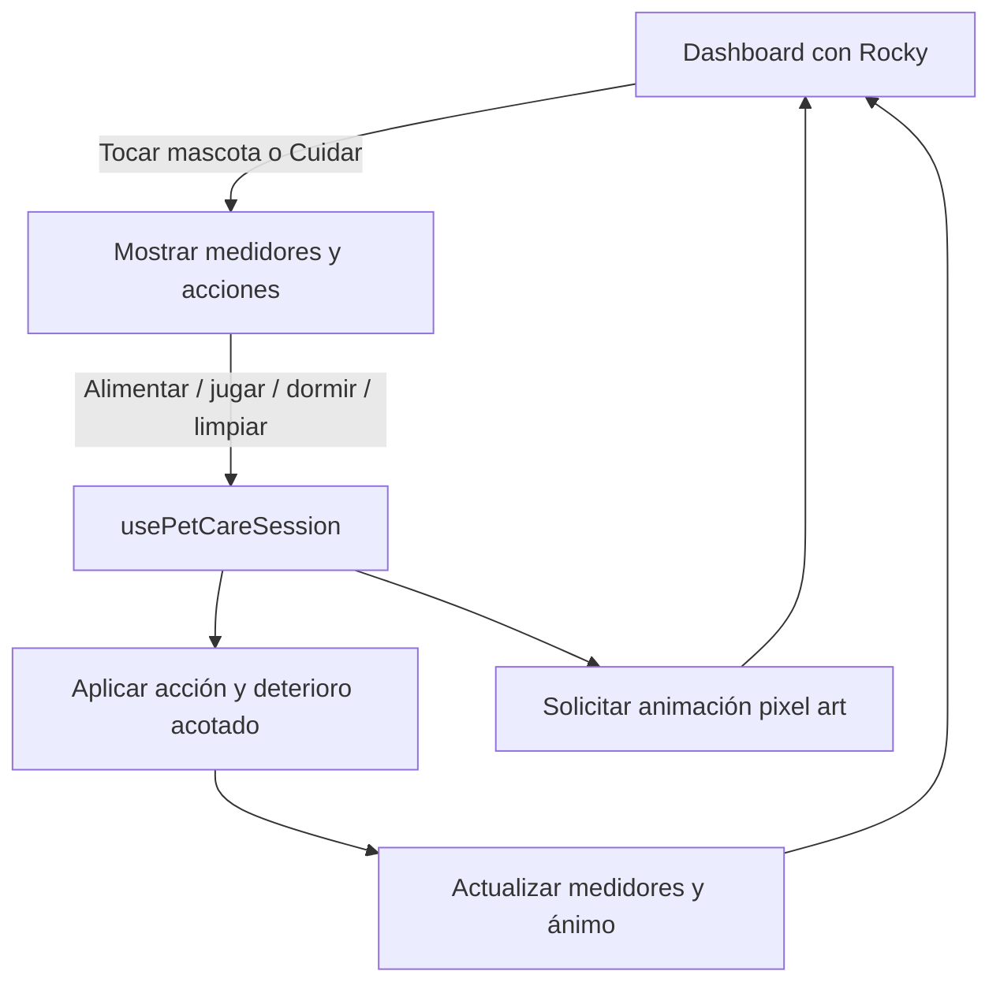
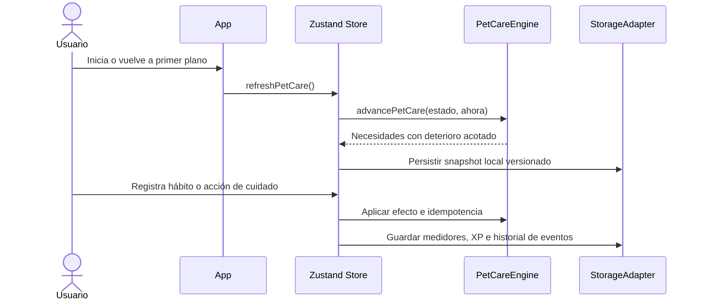

# TAM-001 — Rocky, mascota virtual estilo Tamagotchi clásico

## Estado del plan

- **Tipo:** Feature y rediseño visual.
- **Estado general:** R1–R6 completadas; R7 implementada con UAT móvil pendiente.
- **Fase activa:** `TAM-001-R7` — validación visual en dispositivo físico.
- **Decisión de producto:** Rocky será una mascota virtual de pixel art con cuidados persistentes dentro de la franja del dashboard.

## Objetivo de usuario

Convertir la franja de Rocky en un hábitat compacto y legible donde la mascota se mueva, exprese necesidades y permita alimentarla, jugar, descansar y limpiarse. Las acciones saludables registradas en la aplicación también influyen positivamente en Rocky.

## Dictamen del Comité de Expertos

- **Propuesta evaluada:** Tamagotchi clásico pixel art integrado al dashboard.
- **Veredicto:** APROBADO CON OBSERVACIONES.
- **Salud y nutrición:** Los estados de Rocky deben motivar sin culpabilizar, castigar ni asociar la apariencia corporal con fracaso moral.
- **Retención y UX:** Las acciones básicas deben resolverse en un máximo de dos toques desde la franja.
- **Riesgos técnicos o de tienda:** El sistema debe funcionar offline, respetar la reducción de movimiento y evitar notificaciones insistentes.
- **Ajustes obligatorios:** Limitar el deterioro durante ausencias, ofrecer recuperación inmediata y mantener separados el cuidado lúdico y las métricas clínicas del usuario.

### Dictamen complementario para TAM-001-R7

- **Propuesta evaluada:** Dar profundidad visual al hábitat y sustituir el panel grande de cuidados por burbujas compactas con porcentaje y acción directa.
- **Veredicto:** APROBADO CON OBSERVACIONES.
- **Observaciones de Salud / Nutrición:** Los porcentajes representan necesidades lúdicas de Rocky; no deben confundirse con métricas clínicas ni transmitir culpa.
- **Observaciones de Retención / UX:** La acción directa reduce fricción y mantiene a Rocky como foco principal. El estado debe comprenderse por icono, nombre y porcentaje, sin depender únicamente del color.
- **Riesgos Técnicos o de Tienda:** El escenario debe conservar rendimiento y funcionamiento offline. Las burbujas necesitan un área táctil mínima de 48 × 48 dp y etiquetas accesibles.
- **Ajustes Obligatorios Requeridos:** Evitar negro puro como única superficie del hábitat, aumentar la legibilidad de los muebles, conservar confirmación visual al tocar una burbuja y ofrecer movimiento reducido.

## Alcance funcional

### Incluido

- Pixel art de Rocky con silueta reconocible a escala móvil.
- Movimiento horizontal dentro de la franja.
- Necesidades persistentes: hambre, felicidad, energía y limpieza.
- Acciones: alimentar, jugar, dormir y limpiar.
- Animaciones contextuales para necesidades, acciones y celebraciones.
- Objetos de hábitat: cama, plato, agua y juguete.
- XP, nivel, accesorios y diálogos; la silueta de Rocky es lúdica y no refleja métricas corporales.
- Integración con hidratación, comidas, rutinas y pesaje semanal.
- Persistencia offline y cálculo de tiempo transcurrido.
- Accesibilidad táctil, etiquetas y modo de movimiento reducido.

### Fuera de la primera entrega

- Moneda premium o compras dentro de la aplicación.
- Funciones sociales o visitas a mascotas de otras personas.
- Castigos irreversibles, muerte o pérdida permanente de Rocky.
- Sonido obligatorio; cualquier audio futuro será opcional.

## Contrato del ciclo de cuidado

| Necesidad | Acción directa | Evento saludable relacionado | Respuesta de Rocky |
|---|---|---|---|
| Hambre | Alimentar | Registrar comidas | Come y mejora su ánimo |
| Felicidad | Jugar | Completar objetivos | Juega o celebra |
| Energía | Dormir | Completar rutina y respetar descanso | Descansa o se activa |
| Limpieza | Limpiar | Constancia diaria | Se asea y recupera comodidad |

Las necesidades bajan con el tiempo dentro de límites configurables. Una ausencia prolongada nunca reduce un medidor a un estado punitivo irreversible.

## Fases y estado

| ID | Fase | Entregable | Estado |
|---|---|---|---|
| `TAM-001-P1` | Maestro visual 3D | Asset legado | Retirado en R6 |
| `TAM-001-P2` | Sprites 3D básicos | `idle`, `walk`, `interact` | Assets retirados en R6 |
| `TAM-001-P3` | Reproductor de sprites | Player y registro extensible | Reutilizable con ajustes |
| `TAM-001-P4` | Patrulla en la franja | Hábitat móvil actual | Reutilizable con ajustes |
| `TAM-001-R1` | Dirección pixel art | Guía visual y fotograma semilla aprobado | Completado |
| `TAM-001-R2` | Sprites completos | Secuencias normalizadas y vistas previas | **Completado** |
| `TAM-001-R3` | Dominio de cuidados | Tipos, reglas temporales y pruebas puras | **Completado** |
| `TAM-001-R4` | Interfaz de interacción | Medidores, menú y objetos del hábitat | **Completado** |
| `TAM-001-R5` | Persistencia e integración | Estado offline y eventos fitness | **Completado** |
| `TAM-001-R6` | Sustitución y QA | Retiro de assets heredados, revisión del pesaje y validación final | **Completado** |
| `TAM-001-R7` | Refinamiento del hábitat | Escenario pixel art visible y burbujas de cuidado accionables | **Implementado; UAT móvil pendiente** |

## TAM-001-R1 — Dirección visual y fotograma semilla

### Objetivo

Fijar la apariencia de producción de Rocky antes de generar las secuencias completas.

### Especificación visual

- Pixel art nítido, sin suavizado ni apariencia 3D.
- Vista lateral tres cuartos orientada a la derecha.
- Cuerpo completo y anclaje inferior central.
- Silueta compacta con cola anillada, máscara facial y orejas legibles.
- Paleta limitada: negro, carbón, ámbar oscuro, dorado y crema.
- Contorno oscuro continuo y grupos de píxeles definidos.
- Accesorio distintivo: dije pequeño de bellota dorada.
- Fondo realmente transparente.
- Sin texto, interfaz, escenario, halo, sombras difusas ni partículas.

### Criterios de aceptación

- **Dado** el fotograma visto al tamaño previsto en la franja, **cuando** se muestra sin ampliación, **entonces** Rocky se reconoce como mapache y conserva ojos, máscara y cola legibles.
- **Dado** el activo exportado, **cuando** se inspeccionan sus bordes, **entonces** no presenta fondo, halo ni píxeles semitransparentes causados por suavizado.
- **Dado** el pipeline de animación, **cuando** se use el fotograma como semilla, **entonces** dispone de cuerpo completo, margen suficiente y anclaje inferior central.
- **Dada** la paleta de producción, **cuando** se cuentan los colores visuales principales, **entonces** permanece deliberadamente limitada y coherente con el tema negro y dorado.

## Arquitectura prevista

## TAM-001-R4 — Interfaz de cuidados y acciones

### Alcance entregado

- Panel accesible con medidores para hambre, ánimo, energía y limpieza.
- Menú expandible con alimentar, jugar, dormir y limpiar; cada acción aplica el motor puro y reproduce su animación pixel art.
- Rocky cambia entre animación tranquila, cansada y triste según la necesidad más baja; los mensajes son empáticos.
- Hábitat con objetos pixelados de cama, plato y juguete.
- Estado temporal en memoria; R5 lo reemplaza con estado offline persistido y lo integra con hidratación, comidas, rutinas y pesaje.

### Criterios de aceptación

- Al tocar a Rocky o el botón Cuidar se muestran acciones en la misma franja.
- Al ejecutar una acción, los medidores aplican los efectos del motor y Rocky reproduce el sprite correspondiente.
- Cada medidor anuncia su nombre y valor mediante accesibilidad; los targets táctiles de acciones miden al menos 48 dp.
- El catálogo pixel art incluye diez animaciones con cuatro fotogramas locales cada una.
- La inactividad no culpa al usuario; la integración futura conserva el piso de deterioro del motor.

### Flujo de interacción

## TAM-001-R5 — Persistencia e integración con hábitos

### Alcance entregado

- Estado de hambre, ánimo, energía y limpieza persistido offline junto al estado existente de la app, con `petCareVersion: 1` y migración aditiva para instalaciones previas.
- Deterioro temporal limitado por el motor al iniciar, volver a primer plano, cada 15 minutos mientras la app está activa y efectuar acciones; el piso de ausencia nunca castiga valores que ya estén más bajos.
- Acciones directas de Rocky persisten sus medidores mediante el `StorageAdapter`.
- Vaso de agua, cuatro tiempos de comida completos, rutina completada y pesaje entregan efectos de cuidado y XP configurables.
- Identificadores persistentes hacen idempotente el premio por vaso, por día completo de comidas, por rutina diaria y por pesaje diario.
- Repetir o deshacer registros no revierte XP ya ganado ni vuelve a otorgar el mismo premio.
- R6 elimina la relación entre el valor del pesaje, la silueta de Rocky y los mensajes de kilos perdidos; el XP por registrar el hábito se conserva.

## TAM-001-R6 — Sustitución visual, bienestar y QA final

### Cambios entregados

- Retirados los sprites y previews 3D antiguos, además de los maestros 3D sin referencias; el registro activo mantiene diez animaciones pixel art y cuarenta cuadros locales RGBA de 256 × 256 px.
- El reproductor conserva una sola fuente de sprites; el hábitat muestra cama, plato, vaso de agua y juguete, y acciones/eventos saludables disparan animaciones contextuales.
- El pesaje celebra guardar el registro, pero la cifra ya no cambia la forma de Rocky ni aparece en el diálogo de la mascota. El contrato de `shape` queda como campo legado hasta una migración futura, sin sincronización con métricas corporales.
- Se actualizó el manual técnico y las referencias del hábitat al comportamiento Tamagotchi actual.
- La retirada reduce aproximadamente 16.8 MB de assets heredados del repositorio.

### Criterios de QA

- Los 40 cuadros registrados existen, son PNG RGBA de 256 × 256 y no requieren red.
- No hay imports/referencias de producción hacia sprites viejos ni recursos 3D de Rocky.
- Eventos de agua, comidas, rutinas, pesajes y cuidados muestran la animación contextual adecuada.
- La acción de pesaje preserva XP y nivel, conserva el campo legado sin modificarlo y produce un mensaje neutral sin valores de peso.
- Reducir movimiento, persistencia, migración e idempotencia conservan sus pruebas.

### Limitación de QA

La validación automatizada y la inspección web en escritorio no reemplazan la UAT en dispositivos Android/iOS; no se ejecutó emulador o dispositivo físico en esta sesión.

### Contrato de eventos saludables

| Evento | Cuidado | XP | Idempotencia |
|---|---|---:|---|
| Agregar vaso | Energía +4, ánimo +1 | 10 | Fecha local + ordinal de vaso |
| Completar desayuno, comida, cena y snack | Hambre +15, ánimo +3 | 30 | Una vez por fecha |
| Completar rutina | Ánimo +8, energía +4, limpieza -2 | 50 | Una vez por fecha |
| Registrar pesaje | Ánimo +5 | 100 | Una vez por fecha |

Los cambios de medidor se limitan a 0–100. Los efectos son gamificación y no cambian prescripciones, metas clínicas ni valoración corporal.

### Migración y ciclo de vida

## TAM-001-R7 — Hábitat visible y cuidados compactos

> **Estado:** Implementación y validaciones automatizadas completadas. Pendiente la revisión visual y táctil en Android o iOS.

### Objetivo de usuario

Hacer que la franja se perciba como el hogar pixel art de Rocky y permitir consultar o atender sus cuatro necesidades sin que el panel de cuidados desplace el resto del dashboard.

### R7.1 — Profundidad y legibilidad del hábitat

- Sustituir el negro uniforme por un escenario oscuro en capas: pared en azul carbón, franja de zócalo, piso pixelado y una iluminación ambiental cálida muy sutil.
- Mantener una zona central despejada para el recorrido de Rocky y colocar los objetos en los extremos o el fondo, sin interferir con su área táctil.
- Redibujar o escalar cama, plato, vaso de agua y juguete para que cada objeto sea reconocible al tamaño real de la franja.
- Usar contorno, contraste local y una sombra pixelada corta para separar a Rocky y los muebles del fondo.
- Resolver el escenario con recursos locales y repetibles; no se permitirán imágenes o texturas remotas.

#### Criterios de aceptación

- **Dado** el dashboard en tema oscuro, **cuando** se observa la franja, **entonces** se distinguen pared, piso y al menos tres objetos sin depender de aumentar el brillo de la pantalla.
- **Dado** Rocky en cualquier punto de su patrulla, **cuando** pasa frente al escenario, **entonces** su silueta y sus detalles principales mantienen contraste suficiente.
- **Dado** un ancho móvil compacto, **cuando** se distribuyen los objetos, **entonces** ninguno tapa a Rocky ni invade su objetivo táctil.
- **Dado** el modo de movimiento reducido, **cuando** está activo, **entonces** el escenario permanece legible y Rocky conserva una posición estable.

### R7.2 — Burbujas accionables de cuidado

- Reemplazar la tarjeta expandida de medidores y el botón `Cuidar` por una fila compacta de cuatro burbujas: hambre, ánimo, energía y limpieza.
- Cada burbuja muestra icono pixel art o pictograma, porcentaje numérico y un nombre accesible. El color funciona como apoyo semántico, no como único indicador.
- Tocar una burbuja ejecuta su acción asociada: hambre → alimentar, ánimo → jugar, energía → descansar y limpieza → limpiar.
- Después del toque, la burbuja muestra feedback inmediato, Rocky reproduce la animación correspondiente y el nuevo porcentaje se refleja sin abrir otro panel.
- La distribución admite dos filas de dos burbujas en pantallas estrechas y una fila de cuatro cuando existe espacio suficiente.
- Cada control conserva un objetivo táctil mínimo de 48 × 48 dp, estados presionado/deshabilitado y una etiqueta para lector de pantalla que anuncie necesidad, valor y acción.

#### Criterios de aceptación

- **Dado** el dashboard, **cuando** el usuario ve a Rocky, **entonces** puede consultar las cuatro necesidades sin expandir un panel adicional.
- **Dada** una burbuja de cuidado, **cuando** el usuario la toca, **entonces** la acción se completa en un solo toque, se persiste el nuevo estado y se reproduce la animación contextual.
- **Dado** un porcentaje bajo, **cuando** se presenta la burbuja, **entonces** sigue siendo comprensible mediante nombre, número e icono aunque el usuario no distinga el color.
- **Dado** un dispositivo móvil estrecho, **cuando** se muestran los controles, **entonces** no existe desplazamiento horizontal ni solapamiento y todos los objetivos miden al menos 48 × 48 dp.
- **Dado** un lector de pantalla, **cuando** enfoca una burbuja, **entonces** anuncia, por ejemplo, “Hambre, 80 por ciento, alimentar a Rocky, botón”.

### Impacto técnico y dependencias

- `src/components/virtual-pet/RockyHabitat.tsx`: composición visual, capas del escenario y distribución responsive.
- `src/components/virtual-pet/PetCarePanel.tsx`: retirada del panel grande de la vista principal.
- `src/components/virtual-pet/PetCareMeter.tsx` y `PetCareActionButton.tsx`: sustitución por un componente único de presentación `PetCareBubble`, manteniendo responsabilidades visuales separadas.
- `src/components/VirtualPetView.tsx`: orquestación de la fila de burbujas mediante estado y callbacks existentes.
- `src/hooks/usePetCareSession.ts`: se conserva el contrato actual de acción y animación; no cambia el motor de cuidados ni la persistencia.
- Assets locales del hábitat: muebles y superficies pixel art normalizados para móvil.

### Estrategia SOLID

- **SRP:** `RockyHabitat` compone el escenario; `PetCareBubble` representa un solo control; el hook sigue coordinando la sesión.
- **OCP:** iconos, colores, etiquetas y acciones se declaran en un registro de necesidades, ampliable sin modificar el componente base.
- **LSP:** cada entrada del registro cumple el mismo contrato visual y de interacción.
- **ISP:** la burbuja recibe únicamente necesidad, valor, estado visual y callback.
- **DIP:** la UI emite callbacks; no importa el store ni escribe directamente en almacenamiento.

### Plan de ejecución

1. Definir tokens del hábitat y un wireframe responsive para móvil y escritorio.
2. Crear o ajustar los assets pixel art locales de pared, piso y muebles.
3. Implementar el escenario por capas y validar el recorrido de Rocky.
4. Implementar `PetCareBubble` y el registro declarativo de las cuatro necesidades.
5. Integrar las burbujas con las acciones, animaciones y persistencia existentes.
6. Validar contraste, lector de pantalla, objetivos táctiles, movimiento reducido y resoluciones Android/iOS.
7. Ejecutar QA de regresión y UAT física antes de marcar R7 como completada.

### Fuera de alcance de R7

- Nuevas necesidades, monedas o economía virtual.
- Compra y colocación libre de muebles.
- Cambios en las fórmulas de deterioro, XP o nivel.
- Sonidos nuevos o recursos descargados desde internet.

## Riesgos y controles

| Riesgo | Control |
|---|---|
| Inconsistencia entre cuadros | Generar cada secuencia como una tira desde un único fotograma semilla aprobado |
| Exceso de recursos | Paleta limitada, cuadros compactos y animaciones cortas |
| Culpa por inactividad | Límites de deterioro, mensajes empáticos y recuperación rápida |
| Acoplamiento UI/dominio | Motor de cuidados puro, selectores específicos y callbacks |
| Pérdida del estado actual | Migración con valores predeterminados y persistencia versionada |
| Hábitat demasiado oscuro | Separar pared, piso, objetos y personaje mediante luminancia, contornos y contraste local |
| Burbujas pequeñas o ambiguas | Objetivo mínimo de 48 × 48 dp, porcentaje visible, icono, etiqueta y anuncio accesible |
| Toques accidentales | Estado presionado claro y bloqueo breve mientras se procesa la acción |

## Definición de terminado

Cada fase requiere `npm run quality`, reporte de cumplimiento, evidencia SOLID, revisión visual y actualización de este documento. R7 requiere además UAT en al menos un dispositivo Android o iOS y revisión en ancho móvil compacto antes de marcarse como completada.
