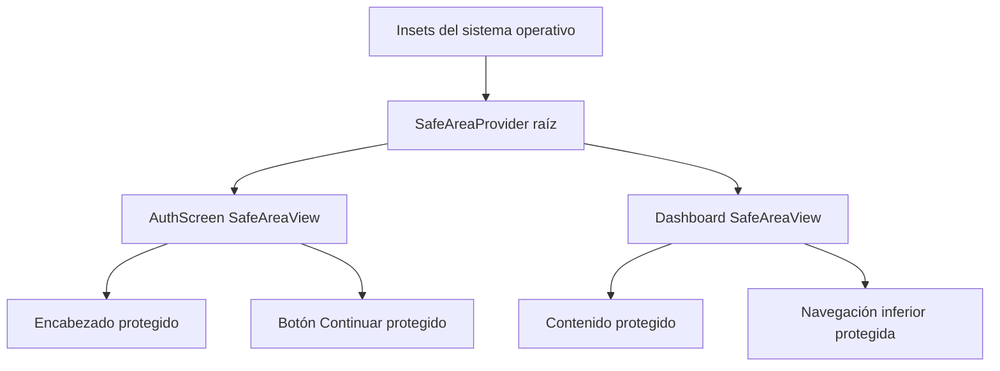

# Áreas seguras multiplataforma

## Propósito y alcance

Evitar que el contenido interactivo del onboarding y de la aplicación principal quede debajo de la barra de estado, recortes físicos o navegación del sistema en Android e iOS.

## Flujo de composición

## Detalles de implementación

- `SafeAreaProvider` se monta una sola vez en el punto de entrada.
- `AuthScreen` y `App` consumen `SafeAreaView` desde `react-native-safe-area-context`.
- Las cuatro aristas se protegen para conservar compatibilidad con orientación, recortes y navegación configurables.
- Los espacios internos propios de botones y tarjetas permanecen en sus componentes; no se duplican insets con cifras fijas.

## Casos de borde y manejo de errores

- Android con navegación por tres botones o gestos.
- Dispositivos edge-to-edge con cámara perforada o notch.
- iPhone con notch o Dynamic Island.
- Cambio de perfil que alterna entre onboarding y aplicación sin desmontar el provider raíz.

## Referencias cruzadas

- `index.ts`
- `App.tsx`
- `src/screens/AuthScreen.tsx`
- `.agents/reports/ANDROID-001-safe-area-compliance-report.md`

