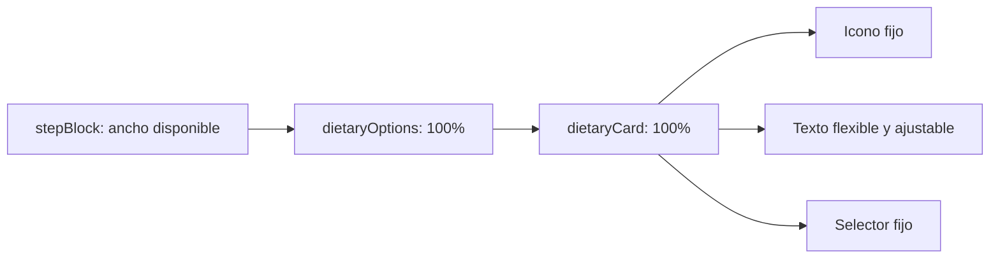

# Layout de preferencias alimentarias

## Propósito y alcance

Garantizar que cada preferencia del onboarding muestre su icono, título, descripción y selector en Android e iOS, incluso dentro del bloque centrado y en pantallas compactas.

## Flujo de distribución

## Detalles de implementación

- La lista declara `width: '100%'` para evitar que el padre centrado la reduzca al ancho mínimo de sus hijos.
- Cada tarjeta ocupa el ancho de la lista.
- El bloque de texto usa `flex: 1` y `minWidth: 0`, permitiendo envolver títulos y descripciones sin desplazar el selector.
- La selección, los valores persistidos y el contenido nutricional permanecen sin cambios.

## Casos de borde y manejo de errores

- Pantallas Android estrechas y escalas de fuente mayores.
- Descripciones de varias líneas.
- Opción activa con borde resaltado y marca de selección.
- La solución usa dimensiones relativas y no depende de píxeles de ancho del dispositivo.

## Referencias cruzadas

- `src/screens/AuthScreen.tsx`
- `__tests__/dietaryPreferenceLayout.test.ts`
- `.agents/reports/ANDROID-002-dietary-preference-layout-compliance-report.md`
