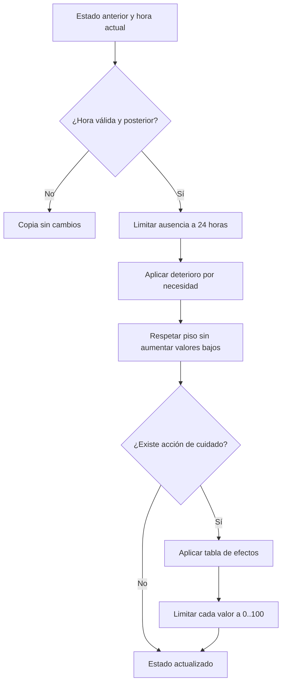

# Motor de cuidados de Rocky

## Responsabilidad

`src/core/petCareEngine.ts` calcula el estado de cuidado de Rocky. Es lógica funcional pura: no conoce React, Zustand, AsyncStorage, componentes ni recursos visuales.

## Medidores

| Necesidad | Valor inicial | Deterioro por hora | Acción principal |
|---|---:|---:|---|
| Hambre | 80 | 3 | Alimentar |
| Felicidad | 80 | 1 | Jugar |
| Energía | 80 | 2 | Dormir |
| Limpieza | 80 | 1 | Limpiar |

Los valores se limitan al intervalo `0..100`. El deterioro automático se calcula durante un máximo de 24 horas por ausencia y usa un piso de 20. Si un medidor ya está por debajo de 20, el reloj lo conserva en ese valor; nunca lo recupera automáticamente.

## Efectos de las acciones

| Acción | Efectos |
|---|---|
| Alimentar | Hambre `+35`, felicidad `+5` |
| Jugar | Felicidad `+35`, energía `-8`, limpieza `-4` |
| Dormir | Energía `+45`, hambre `-6` |
| Limpiar | Limpieza `+45`, felicidad `+4` |

Antes de aplicar una acción, el motor actualiza el deterioro correspondiente al tiempo transcurrido. Esto evita que abrir la app y cuidar a Rocky omita las necesidades acumuladas.

## Nivel de atención

- `content`: todos los medidores son mayores que 50.
- `needs_attention`: al menos un medidor está entre 26 y 50.
- `urgent`: al menos un medidor es 25 o menor.

Cuando dos medidores tienen el mismo valor, la prioridad estable es hambre, energía, limpieza y felicidad. Esta prioridad solo ayuda a seleccionar el mensaje o animación; no impide que el usuario elija cualquier acción.

## Flujo

## API pública

- `createInitialPetCare`: crea los cuatro medidores.
- `advancePetCare`: aplica exclusivamente el paso del tiempo.
- `applyPetCareAction`: actualiza el tiempo y después aplica una acción.
- `findLowestCareNeed`: identifica la necesidad prioritaria.
- `resolvePetCareStatus`: clasifica el nivel general de atención.

La configuración se puede inyectar mediante `PetCareConfig`. Esto permite ajustar balance, probar escenarios acelerados o crear eventos especiales sin modificar el algoritmo.

## Integración prevista

`TAM-001-R4` consume este motor mediante props y callbacks para mostrar los medidores y el menú. `TAM-001-R5` conecta necesidades y efectos de eventos saludables con `StorageAdapter` y migración versionada offline. `TAM-001-R6` conserva un contrato de avatar independiente de las métricas clínicas.
