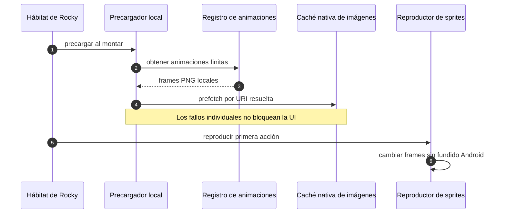

# Precarga de la primera interacción de Rocky

## Propósito y alcance

Evitar el parpadeo observado en Android cuando una animación finita de Rocky se reproduce por primera vez después de abrir o reiniciar la aplicación.

## Flujo de recursos

## Detalles de implementación

- `rockyAssetPreloader.ts` deriva los frames de todas las definiciones finitas del registro; no mantiene una segunda lista de acciones.
- Cada asset estático se resuelve a su URI de Expo/React Native y entra en la caché nativa cuando se monta el hábitat.
- Una promesa compartida evita repetir la misma precarga durante el ciclo de vida del módulo.
- `RockySpritePlayer` establece `fadeDuration={0}` porque el fundido predeterminado de Android puede durar más que algunos frames de la animación.
- Los ciclos y duraciones aprobados del registro permanecen intactos.

## Casos de borde y manejo de errores

- Si un frame no puede precargarse, su promesa se recupera y `Image` conserva su ruta normal de carga.
- La aplicación continúa siendo offline-first: todos los recursos proceden de `assets/rocky` y no se incorporan URLs remotas.
- Las animaciones infinitas que ya se muestran al cargar (`idle`, `walk`, estados de ánimo) no se duplican en la precarga finita.
- La precarga se reinicia con un arranque completo de la aplicación, que es cuando la caché puede estar fría.

## Referencias cruzadas

- `src/components/virtual-pet/rockyAssetPreloader.ts`
- `src/components/virtual-pet/RockyHabitat.tsx`
- `src/components/virtual-pet/RockySpritePlayer.tsx`
- `__tests__/rockyFirstInteraction.test.ts`
- `.agents/reports/ANDROID-003-rocky-first-interaction-compliance-report.md`
