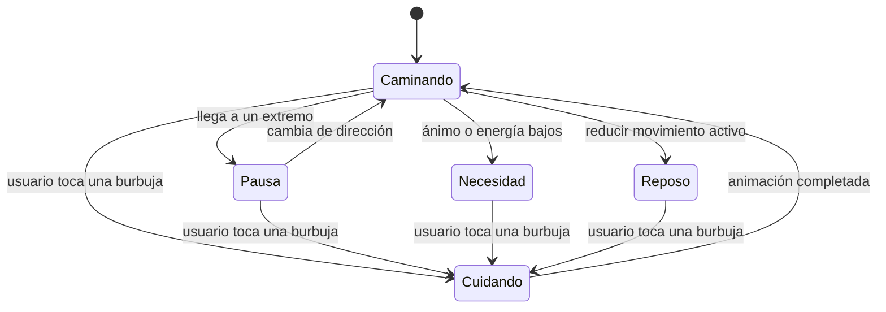

# Hábitat Tamagotchi pixel art de Rocky

## Propósito y alcance

Este módulo presenta el Rocky pixel art del Tamagotchi, lo mueve por una habitación pixel art unificada y ofrece cuatro cuidados accionables. La pared, el piso, la cama, los platos y la decoración forman un único asset local con la misma paleta, contorno, escala de píxel e iluminación de Rocky. El estado y las acciones se inyectan por props desde la capa superior.

## Flujo conceptual

## Detalles de implementación

| Pieza | Responsabilidad |
|---|---|
| `RockyHabitat` | Mide el espacio, contiene el área táctil y los objetos del hábitat, reproduce animaciones. |
| `petHabitatTheme` | Centraliza dimensiones y fallback cromático del hábitat. |
| `PetCareBubbles` | Distribuye las cuatro necesidades en controles compactos y responsive. |
| `PetCareBubble` | Muestra icono y porcentaje y emite la acción mediante callback. |
| `useRockyPatrol` | Ejecuta cada tramo del recorrido y conserva la dirección. |
| `patrolMath` | Calcula distancia disponible y duración según velocidad. |
| `RockySpritePlayer` | Reproduce la secuencia registrada y voltea el sprite. |

El recorrido usa una velocidad de 52 píxeles por segundo y una pausa de 650 ms en cada extremo. La posición se anima con el driver nativo. Las acciones reciben solicitudes animadas con un identificador para reiniciar cada secuencia; las animaciones de acción terminan y reanudan la patrulla.

## Casos de borde

- Si el hábitat es más estrecho que Rocky, la distancia se limita a cero.
- Si cambia el ancho disponible, la posición se ajusta al nuevo límite.
- Si está activa la reducción de movimiento, Rocky no patrulla y muestra la animación de ánimo seleccionada.
- Las secuencias de acción son locales y no requieren conexión de red.

## Referencias

- `src/components/virtual-pet/RockyHabitat.tsx`
- `src/hooks/useRockyPatrol.ts`
- `src/components/virtual-pet/RockySpritePlayer.tsx`
- `src/components/virtual-pet/rockyAnimationRegistry.ts`
- `src/components/virtual-pet/PetCareBubbles.tsx`
- `src/components/virtual-pet/PetCareBubble.tsx`
- `src/components/virtual-pet/petHabitatTheme.ts`
- `assets/rocky/pixel/habitat/rocky-room-v2.png`
- `docs/rocky-pixel-sprites.md`
